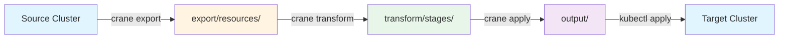
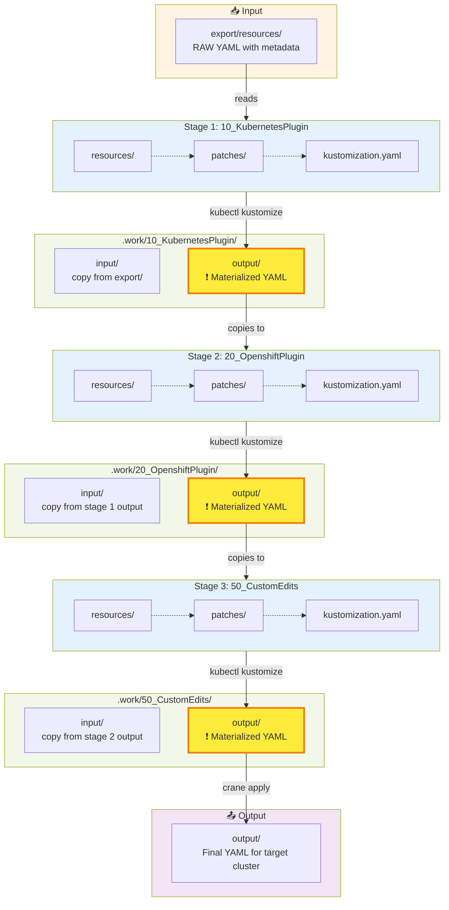
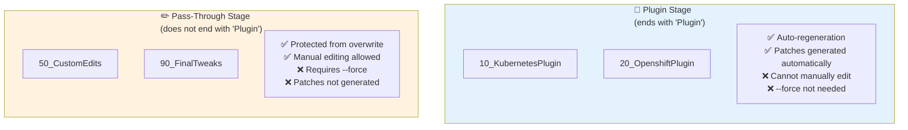
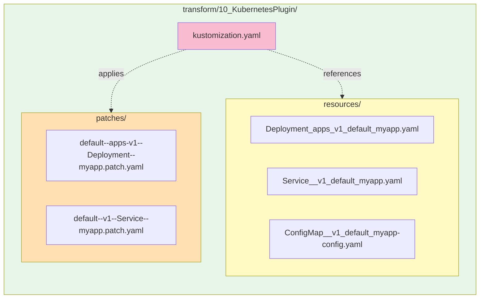
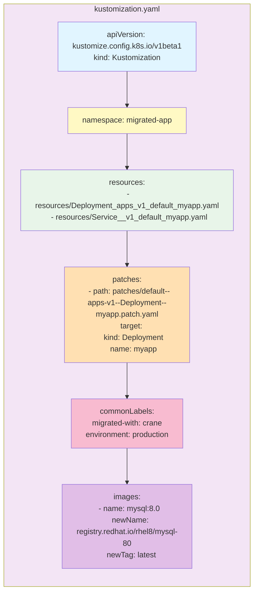
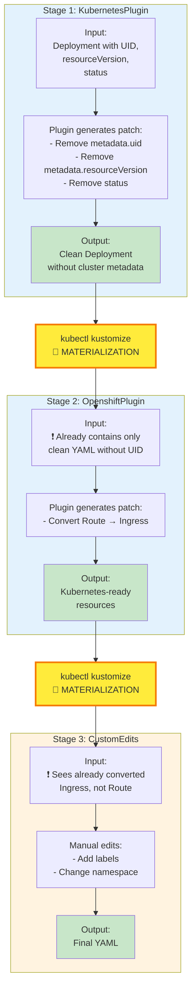
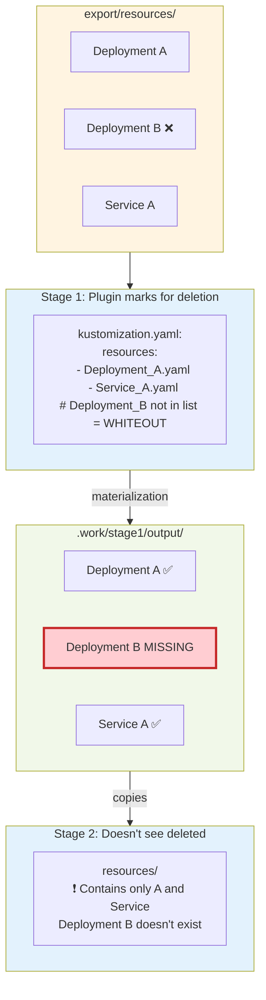
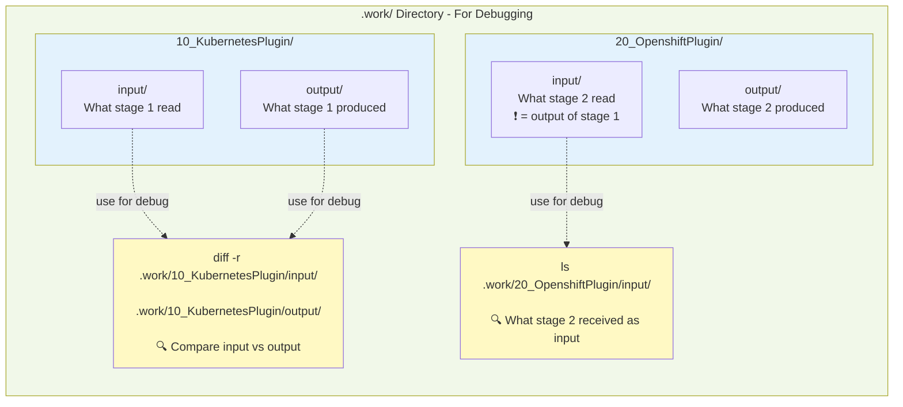
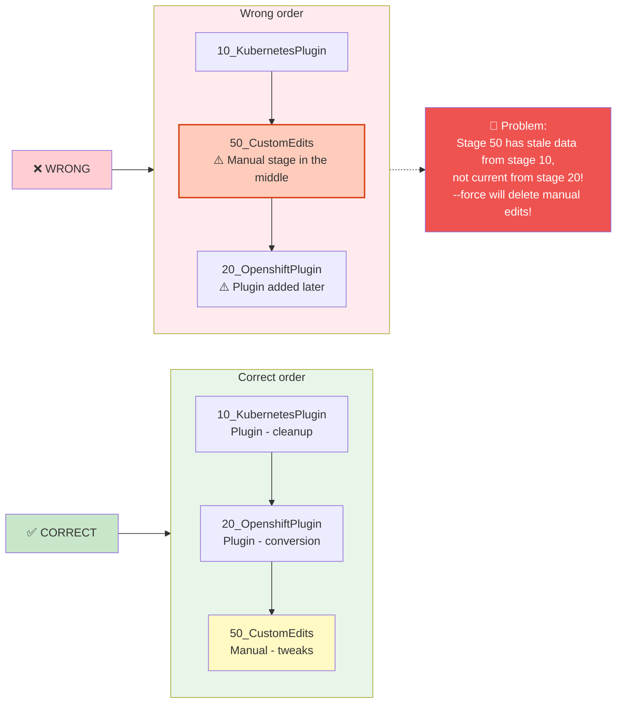
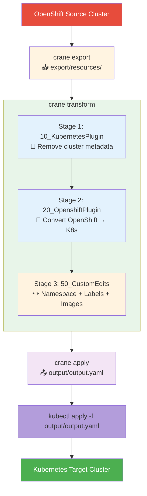

# Crane Transform - Visual Guide

This document contains visualizations to explain the `crane transform` command flow including multiple stages and kustomize.

## 1. Overall Migration Workflow

## 2. Multi-Stage Pipeline - Sequential Processing

**Key Concept**: Each stage sees the **fully materialized output** from the previous stage, not raw patches!

## 3. Stage Types - Plugin vs Pass-Through

## 4. Stage Directory Structure

## 5. Kustomization.yaml - Key Components

## 6. Sequential Consistency - What Does It Mean?

## 7. Whiteout Pattern - Deleting Resources

## 8. Debugging with .work Directory

## 9. Best Practice - Stage Order

## 10. Example Use Case - Cross-Platform Migration

## Legend

| Symbol | Meaning |
|--------|---------|
| 📥 | Input/Import |
| 📤 | Output/Export |
| 🔄 | Plugin Stage (auto-regeneration) |
| ✏️ | Pass-Through Stage (manual editing) |
| 🧹 | Cleanup operation |
| ❗ | Materialized YAML (important concept) |
| ✅ | Feature supported |
| ❌ | Feature not supported |
| ⚠️ | Warning |
| 🔴 | Error/Problem |
| 🔍 | Debugging command |

## How to Use These Diagrams

These Mermaid diagrams can be embedded in:
- **GitHub Markdown** - automatically rendered
- **GitLab** - supports Mermaid
- **VS Code** - with Mermaid Preview extension
- **Notion** - by importing Markdown
- **Online Mermaid Editor** - https://mermaid.live/

For export to PNG/SVG use [Mermaid Live Editor](https://mermaid.live/).
